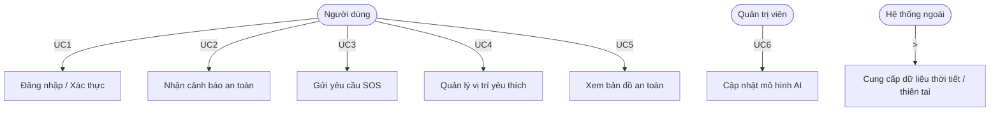
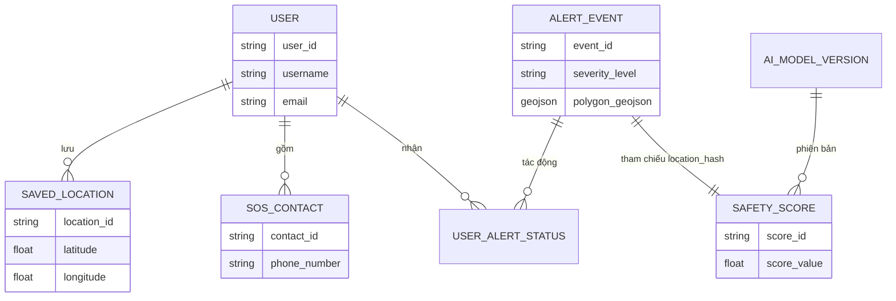

# 03. Thiết Kế Kiến Trúc Hệ Thống (System Architecture Design)

**Dự án:** Intelligent Travel Safety System (PWA)  
**Phiên bản:** 1.4 (Hoàn thiện chính sách Gateway, Log Level và Chi tiết Deployment)  
**Dựa trên:** [02-SRS-Requirements.md](./02-SRS-Requirements.md) 
**Người xây dựng:** *System Architect

---

## I. TỔNG QUAN KIẾN TRÚC (ARCHITECTURE OVERVIEW)

Hệ thống sử dụng **Microservices Architecture** chia thành 4 lớp:
- **Client (PWA)**
- **Gateway**
- **Microservices**
- **Data**

Mô hình này đảm bảo tính **độc lập**, **khả năng mở rộng (NFR4.1)**, và **khả năng phục hồi (Resilience)**.

---

## II. THÀNH PHẦN KIẾN TRÚC CỐT LÕI (CORE ARCHITECTURAL COMPONENTS)

| ID | Tên Module (Microservice) | Chức năng Chính (Theo FR/NFR) | Công nghệ Cốt lõi | Deployment |
|----|-----------------------------|-------------------------------|-------------------|-------------|
| **A-01** | PWA Client & SW | Giao diện, Web Push (FR1.2), Offline Data Sync và lưu queue SOS (FR4.1). | HTML5, JavaScript, Service Worker API | Client-side (Hosting qua CDN) |
| **A-02** | API Gateway | Routing, Load Balancing, Authentication (JWT), Circuit Breaker (NFR2.3), Rate Limiting và Response Caching. | NGINX/Envoy, Kong Gateway | Kubernetes Pod |
| **A-03** | Alert Hub Service | Nhận & xác thực dữ liệu nguồn ngoài (FR1.1), thực hiện Spatial Query (FR1.4), gửi thông báo đẩy. | Python/Go, PostGIS | Kubernetes Pod |
| **A-04** | AI Engine Service | Chạy mô hình Regression/NN (FR2.1), tính toán và lưu Safety Score. | Python (TensorFlow/PyTorch), FastAPI | Kubernetes Pod (GPU Node) |
| **A-05** | User & Auth Service | Quản lý người dùng, Session (JWT), và lưu trữ Vị trí Quan tâm (FR1.5). | Node.js/Java, JWT, SHA256/AES-256 | Kubernetes Pod |
| **A-06** | Map Service | Phục vụ Vector Tiles, xử lý logic hiển thị POI (FR3.2). | GeoServer/Tegola, CDN/CloudFront | Kubernetes Pod |
| **A-07** | SOS Service | Xử lý yêu cầu SOS, gửi cảnh báo đến bên thứ ba (Email/SMS Fallback). | Go/Python, RabbitMQ/Kafka | Kubernetes Pod |

---

## III. MÔ HÌNH TƯƠNG TÁC DỊCH VỤ (SERVICE INTERACTION MODEL)

| Kịch bản | Dịch vụ Giao tiếp | Phương thức | Công nghệ | Lý do |
|-----------|-------------------|--------------|------------|--------|
| **Tính Safety Score** | A-03 → A-04 | Đồng bộ (HTTP/gRPC) | FastAPI | Cần kết quả điểm rủi ro để quyết định gửi cảnh báo |
| **Phân phối Cảnh báo** | A-03 → A-01 | Bất đồng bộ | Web Push API | Gửi hàng loạt, không cần phản hồi ngay |
| **Gửi SOS Fallback** | A-07 → External SMS/Email | Bất đồng bộ | RabbitMQ/Kafka | Đảm bảo gửi tin khẩn cấp ngay cả khi chậm trễ |
| **Xác thực User** | A-02 → A-05 | Đồng bộ (HTTP/gRPC) | JWT/Gateway Logic | Bắt buộc xác thực Token trước mọi request |

>  **Ghi chú:** Sơ đồ tuần tự (Sequence Diagram) chi tiết được đính kèm trong *Phụ lục A*.

---

## IV. CƠ CHẾ KỸ THUẬT NÂNG CAO (ADVANCED TECHNICAL POLICIES)

| Service | Cơ chế Nâng cao | Chi tiết | Mục đích |
|----------|-----------------|-----------|-----------|
| **A-02 (Gateway)** | Rate Limiting | Max 100 req/min/IP cho endpoint công khai | Chống DDoS và lạm dụng API |
| **A-02 (Gateway)** | Timeout & Circuit Breaker | Timeout: 3s, Circuit Breaker ngắt nếu 5 lỗi/10s | Đảm bảo khả năng phục hồi |
| **A-03 (Alert Hub)** | Retry Policy | 3 lần Retry với Exponential Backoff | Tăng độ tin cậy cảnh báo (NFR2.1) |
| **A-04 (AI Engine)** | Model Update Pipeline | Batch Data → Retrain → Smoke Test → Blue/Green Deploy | Đảm bảo chất lượng và cập nhật mô hình |
| **A-06 (Map Service)** | CDN/API Cache | Cache Vector Tiles qua CloudFront/Cloudflare | Tối ưu hiệu năng bản đồ (NFR1.1) |
| **A-07 (SOS Service)** | Acknowledgment Tracking | Lưu ID message, theo dõi ACK trạng thái gửi | Đảm bảo tính *Mission-critical* |

---

## V. SƠ ĐỒ LUỒNG DỮ LIỆU (DATA FLOW DIAGRAM - DFD)

###  Luồng 1: Tính toán & Phân phối Cảnh báo

###  Luồng 2: Xử lý Yêu cầu SOS

###  Hệ thống Log tập trung (Centralized Logging)
Tất cả các microservice từ **A-02 đến A-07** đẩy log về hệ thống trung tâm:
- **Công nghệ:** ELK Stack *(Elasticsearch, Logstash, Kibana)* hoặc *CloudWatch/Datadog*  
- **Log Level Policy:**
  - `INFO`: Truy cập và hoạt động thành công  
  - `ERROR`: Lỗi dịch vụ, lỗi API  
  - `DEBUG`: Log chi tiết (Dev/Staging only)

---

## VI. KIẾN TRÚC CLIENT (PWA & OFFLINE)

### 1️ Offline First Flow (Ví dụ SOS)
1. User nhấn nút **SOS** → PWA gửi API  
2. Nếu mất mạng → Service Worker lưu request vào **IndexedDB Queue**  
3. Khi kết nối phục hồi → SW **Background Sync** tự động gửi lại  
4. SOS Service phản hồi thành công → SW xóa request trong queue

### 2️ Quản lý Cache (FR3.2)

| Thành phần | Cơ chế | Hạn mức |
|-------------|--------|---------|
| **Assets (HTML/CSS/JS)** | Cache First Strategy (Service Worker) | Luôn cache offline |
| **Map Tiles (Vector)** | Network falling back to Cache | Max 50MB |
| **Cache Eviction Policy** | LRU (Least Recently Used) | TTL 24h hoặc khi đạt 50MB |

---

## VII. SƠ ĐỒ THỰC THỂ-QUAN HỆ (HIGH-LEVEL ENTITY RELATIONSHIP DIAGRAM - ERD)

| Thực thể | Thuộc tính Chính (Key Attributes) | Ghi chú & Liên kết SRS |
|-----------|----------------------------------|-------------------------|
| **USER** | user_id (PK), username, email, jwt_expiry | Bảng người dùng (NFR3.2) |
| **SAVED_LOCATION** | location_id (PK), user_id (FK), name, latitude, longitude, encryption_tag | Vị trí quan tâm (FR1.5) |
| **ALERT_EVENT** | event_id (PK), source_api, source_confidence, severity_level, polygon_geojson | Xác thực nguồn và mức độ nguy hiểm (FR1.1, FR1.3) |
| **SAFETY_SCORE** | score_id (PK), location_hash, model_version_id (FK), score_value, calculated_at | Liên kết AI Model (FR2.1) |
| **AI_MODEL_VERSION** | model_version_id (PK), version_number, training_data_batch, deployed_at | Quản lý phiên bản AI |
| **USER_ALERT_STATUS** | user_id (FK), event_id (FK), status | Bảng trung gian N:M |
| **SOS_CONTACT** | contact_id (PK), user_id (FK), contact_name, phone_number | Danh bạ khẩn cấp |

### Mối Quan Hệ Chính
- `USER 1:N SAVED_LOCATION`  
- `ALERT_EVENT N:M USER` *(qua USER_ALERT_STATUS)*  
- `USER 1:N SOS_CONTACT`  
- `AI_MODEL_VERSION 1:N SAFETY_SCORE`  
- `SAFETY_SCORE` được tham chiếu bởi `ALERT_EVENT` qua `location_hash`.

### Chiến lược Indexing
- **PostGIS:** Index GIST cho `polygon_geojson`, `latitude`, `longitude` → tối ưu Geo-fencing (FR1.4)  
- **SQL Index:** Index `user_id`, `location_hash`, `event_id` → tăng tốc truy vấn hiệu năng.

---

## VIII. SƠ ĐỒ USE CASE (USE CASE DIAGRAM)

###  Use Case Chính
- **UC1 – Đăng nhập / Xác thực**
- **UC2 – Nhận cảnh báo an toàn**
- **UC3 – Gửi yêu cầu SOS**
- **UC4 – Quản lý vị trí yêu thích**
- **UC5 – Xem bản đồ an toàn**
- **UC6 – Cập nhật mô hình AI (Admin)**

## IX. SƠ ĐỒ ERD TRỰC QUAN (ENTITY RELATIONSHIP DIAGRAM)

