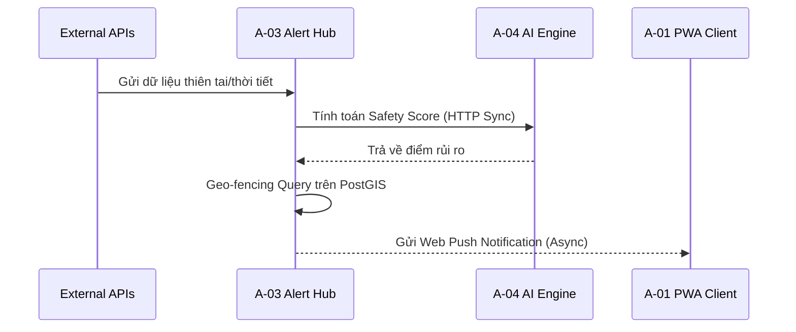
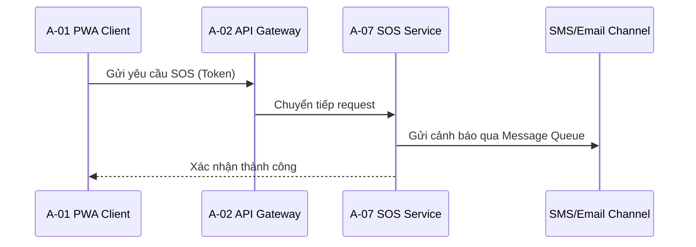
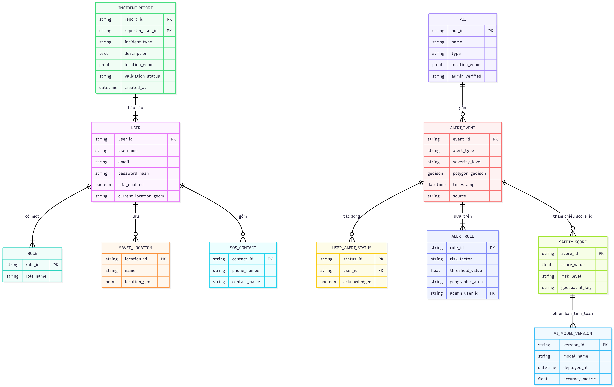

# 03. Thiết Kế Kiến Trúc Hệ Thống (System Architecture Design)

**Dự án:** Intelligent Travel Safety System (PWA)  
**Phiên bản:** 1.4 (Hoàn thiện chính sách Gateway, Log Level và Chi tiết Deployment)  
**Dựa trên:** [02-SRS-Requirements.md](./02-SRS-Requirements.md) 
**Người xây dựng:** *System Architect

---

## I. TỔNG QUAN KIẾN TRÚC (ARCHITECTURE OVERVIEW)

Hệ thống sử dụng **Microservices Architecture** chia thành 4 lớp:
- **Client (PWA)**
- **Gateway**
- **Microservices**
- **Data**

Mô hình này đảm bảo tính **độc lập**, **khả năng mở rộng (NFR4.1)**, và **khả năng phục hồi (Resilience)**.

---

## II. THÀNH PHẦN KIẾN TRÚC CỐT LÕI (CORE ARCHITECTURAL COMPONENTS)

| ID | Tên Module (Microservice) | Chức năng Chính (Theo FR/NFR) | Công nghệ Cốt lõi | Deployment |
|----|-----------------------------|-------------------------------|-------------------|-------------|
| **A-01** | PWA Client & SW | Giao diện, Web Push (FR1.2), Offline Data Sync và lưu queue SOS (FR4.1). | HTML5, JavaScript, Service Worker API | Client-side (Hosting qua CDN) |
| **A-02** | API Gateway | Routing, Load Balancing, Authentication (JWT), Circuit Breaker (NFR2.3), Rate Limiting và Response Caching. | NGINX/Envoy, Kong Gateway | Kubernetes Pod |
| **A-03** | Alert Hub Service | Nhận & xác thực dữ liệu nguồn ngoài (FR1.1), thực hiện Spatial Query (FR1.4), gửi thông báo đẩy. | Python/Go, PostGIS | Kubernetes Pod |
| **A-04** | AI Engine Service | Chạy mô hình Regression/NN (FR2.1), tính toán và lưu Safety Score. | Python (TensorFlow/PyTorch), FastAPI | Kubernetes Pod (GPU Node) |
| **A-05** | User & Auth Service | Quản lý người dùng, Session (JWT), và lưu trữ Vị trí Quan tâm (FR1.5). | Node.js/Java, JWT, SHA256/AES-256 | Kubernetes Pod |
| **A-06** | Map Service | Phục vụ Vector Tiles, xử lý logic hiển thị POI (FR3.2). | GeoServer/Tegola, CDN/CloudFront | Kubernetes Pod |
| **A-07** | SOS Service | Xử lý yêu cầu SOS, gửi cảnh báo đến bên thứ ba (Email/SMS Fallback). | Go/Python, RabbitMQ/Kafka | Kubernetes Pod |

---

## III. MÔ HÌNH TƯƠNG TÁC DỊCH VỤ (SERVICE INTERACTION MODEL)

| Kịch bản | Dịch vụ Giao tiếp | Phương thức | Công nghệ | Lý do |
|-----------|-------------------|--------------|------------|--------|
| **Tính Safety Score** | A-03 → A-04 | Đồng bộ (HTTP/gRPC) | FastAPI | Cần kết quả điểm rủi ro để quyết định gửi cảnh báo |
| **Phân phối Cảnh báo** | A-03 → A-01 | Bất đồng bộ | Web Push API | Gửi hàng loạt, không cần phản hồi ngay |
| **Gửi SOS Fallback** | A-07 → External SMS/Email | Bất đồng bộ | RabbitMQ/Kafka | Đảm bảo gửi tin khẩn cấp ngay cả khi chậm trễ |
| **Xác thực User** | A-02 → A-05 | Đồng bộ (HTTP/gRPC) | JWT/Gateway Logic | Bắt buộc xác thực Token trước mọi request |

>  **Ghi chú:** Sơ đồ tuần tự (Sequence Diagram) chi tiết được đính kèm trong *Phụ lục A*.

---

## IV. CƠ CHẾ KỸ THUẬT NÂNG CAO (ADVANCED TECHNICAL POLICIES)

| Service | Cơ chế Nâng cao | Chi tiết | Mục đích |
|----------|-----------------|-----------|-----------|
| **A-02 (Gateway)** | Rate Limiting | Max 100 req/min/IP cho endpoint công khai | Chống DDoS và lạm dụng API |
| **A-02 (Gateway)** | Timeout & Circuit Breaker | Timeout: 3s, Circuit Breaker ngắt nếu 5 lỗi/10s | Đảm bảo khả năng phục hồi |
| **A-03 (Alert Hub)** | Retry Policy | 3 lần Retry với Exponential Backoff | Tăng độ tin cậy cảnh báo (NFR2.1) |
| **A-04 (AI Engine)** | Model Update Pipeline | Batch Data → Retrain → Smoke Test → Blue/Green Deploy | Đảm bảo chất lượng và cập nhật mô hình |
| **A-06 (Map Service)** | CDN/API Cache | Cache Vector Tiles qua CloudFront/Cloudflare | Tối ưu hiệu năng bản đồ (NFR1.1) |
| **A-07 (SOS Service)** | Acknowledgment Tracking | Lưu ID message, theo dõi ACK trạng thái gửi | Đảm bảo tính *Mission-critical* |

---

## V. SƠ ĐỒ LUỒNG DỮ LIỆU (DATA FLOW DIAGRAM - DFD)

###  Luồng 1: Tính toán & Phân phối Cảnh báo

```mermaid
sequenceDiagram
    participant API_External as External APIs
    participant AlertHub as A-03 Alert Hub
    participant AIEngine as A-04 AI Engine
    participant PWA as A-01 PWA Client

    API_External->>AlertHub: Gửi dữ liệu thiên tai/thời tiết
    AlertHub->>AIEngine: Tính toán Safety Score (HTTP Sync)
    AIEngine-->>AlertHub: Trả về điểm rủi ro
    AlertHub->>AlertHub: Geo-fencing Query trên PostGIS
    AlertHub-->>PWA: Gửi Web Push Notification (Async)
```

###  Luồng 2: Xử lý Yêu cầu SOS

```mermaid
sequenceDiagram
    participant PWA as A-01 PWA Client
    participant Gateway as A-02 API Gateway
    participant SOS as A-07 SOS Service
    participant External as SMS/Email Channel

    PWA->>Gateway: Gửi yêu cầu SOS (Token)
    Gateway->>SOS: Chuyển tiếp request
    SOS->>External: Gửi cảnh báo qua Message Queue
    SOS-->>PWA: Xác nhận thành công
```

###  Hệ thống Log tập trung (Centralized Logging)
Tất cả các microservice từ **A-02 đến A-07** đẩy log về hệ thống trung tâm:
- **Công nghệ:** ELK Stack *(Elasticsearch, Logstash, Kibana)* hoặc *CloudWatch/Datadog*  
- **Log Level Policy:**
  - `INFO`: Truy cập và hoạt động thành công  
  - `ERROR`: Lỗi dịch vụ, lỗi API  
  - `DEBUG`: Log chi tiết (Dev/Staging only)

---

## VI. KIẾN TRÚC CLIENT (PWA & OFFLINE)

### 1️ Offline First Flow (Ví dụ SOS)
1. User nhấn nút **SOS** → PWA gửi API  
2. Nếu mất mạng → Service Worker lưu request vào **IndexedDB Queue**  
3. Khi kết nối phục hồi → SW **Background Sync** tự động gửi lại  
4. SOS Service phản hồi thành công → SW xóa request trong queue

### 2️ Quản lý Cache (FR3.2)

| Thành phần | Cơ chế | Hạn mức |
|-------------|--------|---------|
| **Assets (HTML/CSS/JS)** | Cache First Strategy (Service Worker) | Luôn cache offline |
| **Map Tiles (Vector)** | Network falling back to Cache | Max 50MB |
| **Cache Eviction Policy** | LRU (Least Recently Used) | TTL 24h hoặc khi đạt 50MB |

---

## VII. SƠ ĐỒ THỰC THỂ-QUAN HỆ (HIGH-LEVEL ENTITY RELATIONSHIP DIAGRAM - ERD)

| Thực thể | Thuộc tính Chính (Key Attributes) | Ghi chú & Liên kết SRS |
|-----------|----------------------------------|-------------------------|
| **USER** | user_id (PK), username, email, jwt_expiry | Bảng người dùng (NFR3.2) |
| **SAVED_LOCATION** | location_id (PK), user_id (FK), name, latitude, longitude, encryption_tag | Vị trí quan tâm (FR1.5) |
| **ALERT_EVENT** | event_id (PK), source_api, source_confidence, severity_level, polygon_geojson | Xác thực nguồn và mức độ nguy hiểm (FR1.1, FR1.3) |
| **SAFETY_SCORE** | score_id (PK), location_hash, model_version_id (FK), score_value, calculated_at | Liên kết AI Model (FR2.1) |
| **AI_MODEL_VERSION** | model_version_id (PK), version_number, training_data_batch, deployed_at | Quản lý phiên bản AI |
| **USER_ALERT_STATUS** | user_id (FK), event_id (FK), status | Bảng trung gian N:M |
| **SOS_CONTACT** | contact_id (PK), user_id (FK), contact_name, phone_number | Danh bạ khẩn cấp |

### Mối Quan Hệ Chính
- `USER 1:N SAVED_LOCATION`  
- `ALERT_EVENT N:M USER` *(qua USER_ALERT_STATUS)*  
- `USER 1:N SOS_CONTACT`  
- `AI_MODEL_VERSION 1:N SAFETY_SCORE`  
- `SAFETY_SCORE` được tham chiếu bởi `ALERT_EVENT` qua `location_hash`.

### Chiến lược Indexing
- **PostGIS:** Index GIST cho `polygon_geojson`, `latitude`, `longitude` → tối ưu Geo-fencing (FR1.4)  
- **SQL Index:** Index `user_id`, `location_hash`, `event_id` → tăng tốc truy vấn hiệu năng.

---

## VIII. SƠ ĐỒ USE CASE (USE CASE DIAGRAM)

Biểu đồ Use Case mô tả toàn bộ các tác nhân và chức năng của hệ thống **Intelligent Travel Safety System with Weather & Disaster Warnings**, thể hiện sự tương tác giữa:
- Người dùng (Public User)
- Quản trị viên (Admin/System Operator)
- Cơ quan cứu hộ (Emergency Responder)
- Nhà cung cấp dữ liệu (External Data Provider)
- Dịch vụ xác thực / gửi thông báo ngoài (External Auth & Notification Services)

---

### 🔹 Biểu đồ tổng thể

*Hình 8.1 – Biểu đồ Use Case chi tiết của hệ thống Intelligent Travel Safety System*

---

### 🔸 Danh sách Use Case chi tiết (22 mục)

| Mã UC | Tên Use Case | Nhóm module | Actor liên quan | Mô tả ngắn gọn |
|:------:|---------------|---------------|-----------------|----------------|
| **UC01** | Đăng ký tài khoản | User Management | Public User | Người dùng tạo tài khoản mới để sử dụng hệ thống. |
| **UC02** | Đăng nhập / Xác thực (MFA) | User Management | Public User / Auth Service | Đăng nhập hệ thống, xác thực bằng MFA để đảm bảo an toàn. |
| **UC03** | Cập nhật hồ sơ cá nhân | User Management | Public User | Người dùng chỉnh sửa thông tin cá nhân, email, số điện thoại. |
| **UC04** | Lưu vị trí yêu thích | User Management | Public User | Lưu các địa điểm thường lui tới để theo dõi rủi ro. |
| **UC05** | Nhận cảnh báo an toàn | Alert & Notification | Public User | Nhận thông báo tự động về thiên tai hoặc khu vực rủi ro gần vị trí hiện tại. |
| **UC06** | Xem bản đồ an toàn | Safety Map & Visualization | Public User | Hiển thị bản đồ với các vùng rủi ro, trạm trú ẩn, tuyến đường an toàn. |
| **UC07** | Gửi yêu cầu SOS | Emergency Assistance | Public User | Gửi tín hiệu khẩn cấp và vị trí đến trung tâm cứu hộ. |
| **UC08** | Gửi định vị GPS (tự động) | Emergency Assistance | Public User | Tự động gửi vị trí GPS theo chu kỳ khi bật chế độ khẩn cấp. |
| **UC09** | Báo cáo sự cố địa phương | Incident Reporting | Public User | Báo cáo tình huống nguy hiểm hoặc thiên tai tại khu vực. |
| **UC10** | Kiểm tra trạng thái cảnh báo | Alert Hub | Public User | Xem lịch sử cảnh báo, mức độ nguy hiểm và thời gian cập nhật. |
| **UC11** | Tra cứu hướng dẫn an toàn ngoại tuyến | Safety Map & Offline Mode | Public User | Xem hướng dẫn ứng phó khi không có Internet. |
| **UC12** | Gửi cảnh báo đến trung tâm cứu hộ | SOS / Emergency Dispatch | System / Emergency Responder | Hệ thống tự động chuyển cảnh báo SOS đến đội cứu hộ qua SMS/API. |
| **UC13** | Phản hồi SOS | Emergency Response | Emergency Responder | Trung tâm cứu hộ xác nhận và phản hồi lại tình trạng hỗ trợ. |
| **UC14** | Giám sát cảnh báo hệ thống | Admin & Monitoring | Admin | Theo dõi số lượng cảnh báo, log hoạt động và trạng thái dịch vụ. |
| **UC15** | Quản lý người dùng | Admin & Monitoring | Admin | Thêm, khóa, hoặc chỉnh sửa tài khoản người dùng. |
| **UC16** | Quản lý dữ liệu thiên tai / an toàn | Data Management | Admin | Quản lý dữ liệu vùng nguy hiểm, khu trú ẩn, và dữ liệu bản đồ. |
| **UC17** | Cập nhật mô hình AI | AI Engine Management | Admin | Tải lên mô hình AI mới, triển khai và kiểm thử phiên bản. |
| **UC18** | Giám sát độ chính xác mô hình | AI Engine Monitoring | Admin | Xem thống kê độ chính xác, false positive/negative của mô hình AI. |
| **UC19** | Nhận dữ liệu thời tiết / thiên tai | Data Integration | External Data Provider | Gửi dữ liệu từ OpenWeather, NOAA, hoặc nguồn chính thức khác. |
| **UC20** | Xác thực dữ liệu nguồn | Alert Hub | System / Admin | Kiểm tra độ tin cậy và tính hợp lệ của dữ liệu nhận được. |
| **UC21** | Gửi thông báo ra ngoài (Push/SMS/Email) | Notification Service | System / External Notification API | Gửi thông báo khẩn cấp đến người dùng qua nhiều kênh. |
| **UC22** | Ghi log & theo dõi lỗi hệ thống | Monitoring | System / Admin | Ghi nhận toàn bộ log hoạt động, lỗi và hiệu suất dịch vụ. |

---
## IX. SƠ ĐỒ MÔ HÌNH DỮ LIỆU (ER DIAGRAM)
Biểu đồ ER dưới đây mô tả **cấu trúc dữ liệu và mối quan hệ giữa các thực thể** trong hệ thống *Intelligent Travel Safety System with Weather & Disaster Warnings*.  
Hệ thống được chia thành ba module chính:

- **Module 1 – User Management & Roles:** Quản lý người dùng, phân quyền và thông tin vị trí.  
- **Module 2 – Emergency Assistance & Safety Map:** Lưu vị trí an toàn, danh bạ khẩn cấp, và báo cáo sự cố.  
- **Module 3 – Alerting, Risk Assessment & AI:** Xử lý cảnh báo, tính toán điểm an toàn, và quản lý mô hình AI.

---

*Hình 9.1 – Biểu đồ ER mô tả cấu trúc dữ liệu chính của hệ thống*

---

